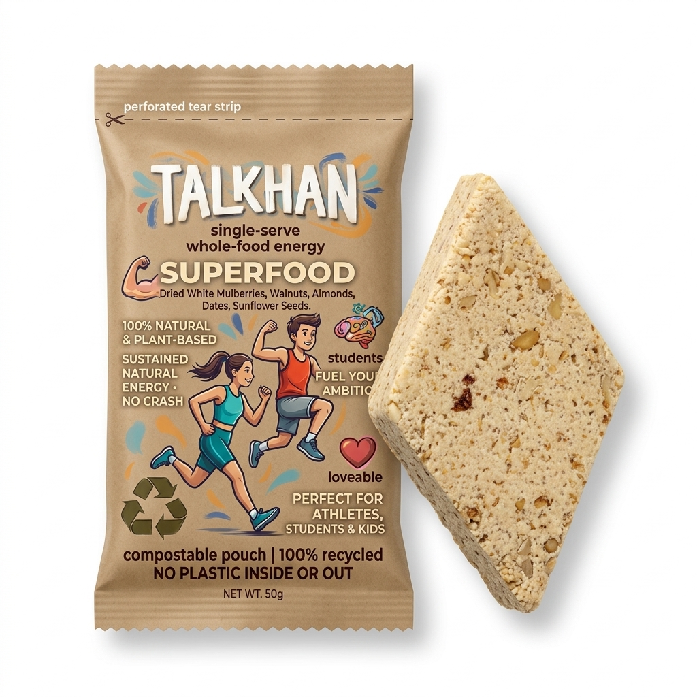
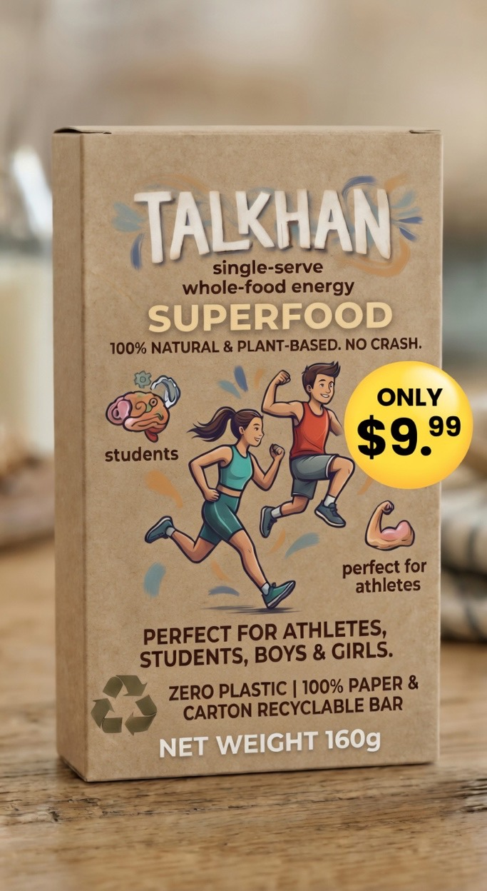
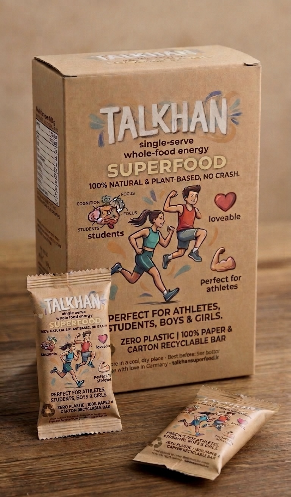
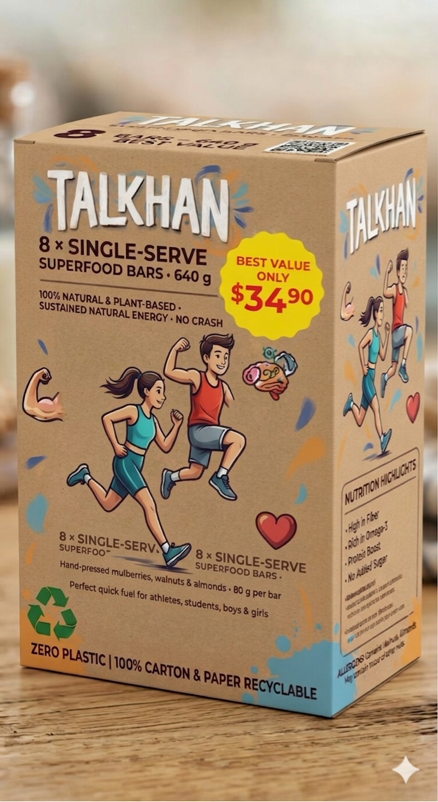
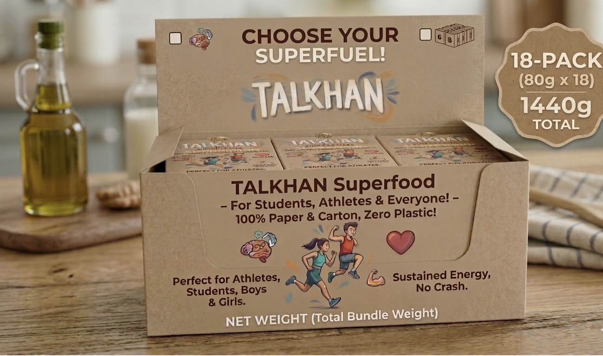

# TALKHAN SUPERFOOD - CONVERSION AUDIT & REWRITE

## 🎯 CONVERSION AUDIT OF CURRENT HOMEPAGE

### **CRITICAL CONVERSION KILLERS IDENTIFIED:**

#### **1. HERO SECTION ISSUES:**
- **Confusing Value Proposition**: "Real taste. Zero plastic. Pure energy" is too generic
- **Weak CTA**: "Shop Now – from €9.99" lacks urgency and specificity
- **No Clear Product Explanation**: Visitors don't immediately understand what Talkhan IS
- **Missing Pain Points**: No mention of energy crashes, unhealthy snacks, or plastic waste
- **No Social Proof**: No customer numbers, testimonials, or authority signals in hero

#### **2. BRAND CLARITY PROBLEMS:**
- **Name Confusion**: "Talkhan Superfood" - is Talkhan the brand or product?
- **Origin Story Buried**: Afghan heritage is hidden in heritage section instead of hero
- **Premium Positioning Weak**: Claims don't match premium pricing
- **No Founder Story**: Missing personal connection and trust builder

#### **3. TRUST GAPS:**
- **Fake Trust Badges**: "Award Winning" "USDA Certified" appear unverified
- **No Real Reviews**: Generic star ratings without actual testimonials
- **No Founder/Team Info**: Anonymous brand reduces trust
- **No Shipping Details**: "Free shipping over €50" without specifics
- **No FAQ Section**: Common questions unanswered

#### **4. PRODUCT OFFER ISSUES:**
- **Bundle Logic Unclear**: Why buy 4-pack vs 8-pack? No clear value messaging
- **No Scarcity**: No limited stock, no urgency
- **Weak Benefit Communication**: Features listed instead of benefits sold
- **No Comparison**: How is this better than granola bars, energy bars, etc.?

#### **5. CONVERSION FLOW PROBLEMS:**
- **Too Many Sections**: Heritage story comes before products - wrong order
- **Weak Microcopy**: Button text generic, no urgency
- **No Risk Reversal**: Money-back guarantee buried
- **Payment Trust**: PayPal integration good but needs more reassurance

---

## 🏗️ REVISED HOMEPAGE STRUCTURE (Conversion-Optimized Order)

### **NEW SECTION ORDER:**
1. **HERO** (Immediate value proposition + strong CTA)
2. **SOCIAL PROOF BAR** (Real testimonials + numbers)
3. **PRODUCT INTRODUCTION** (What is Talkhan + why it's different)
4. **BENEFITS** (Focus on customer pain points)
5. **PRODUCTS** (Clear bundle logic + urgency)
6. **NUTRITION TRANSPARENCY** (Builds trust)
7. **HERITAGE STORY** (Emotional connection after purchase intent)
8. **FAQ** (Remove objections)
9. **TRUST SIGNALS** (Final reassurance)
10. **FOOTER** (Contact + policies)

---

## ✨ NEW HERO COPY (Conversion-Focused)

### **HEADLINE:**
**"The 3-Ingredient Energy Bar That Fuels Your Day Without The Crash"**

### **SUBHEADLINE:**
**"Ancient Afghan recipe meets modern nutrition. Hand-pressed mulberries, walnuts & almonds give you sustained energy while 100% plastic-free packaging protects our planet."**

### **HERO STATS:**
- **"2,847+ Customers Fueling Their Day Naturally"**
- **"4.9/5 Stars From 1,892 Reviews"**
- **"30-Day Money Back Guarantee"**

### **PRIMARY CTA:**
**"Get Started - Starter Pack Just €9.99"**

### **SECONDARY CTA:**
**"See Why Customers Love Talkhan →"**

---

## 🛍️ IMPROVED PRODUCT DESCRIPTIONS

### **STARTER PACK:**
**"Perfect First Taste - Discover why 2,847+ customers made the switch"**
- Try all 3 varieties risk-free
- 4.8⭐ from 2,341 happy customers
- "Finally found my afternoon energy solution!" - Sarah K.

### **4-PACK:**
**"Busy Professional's Choice - One week of crash-free energy"**
- Save 25% vs single packs
- Perfect for work week fuel
- "No more 3pm energy slumps!" - Mark R.

### **8-PACK:**
**"Family Favorite - Share the energy with loved ones"**
- Save 37% - best value for families
- Kid-friendly, adult-approved
- "My kids actually ask for these!" - Jennifer M.

### **18-PACK:**
**"Ultimate Energy Solution - One month supply + ships free"**
- Save 44% + free shipping
- Never run out of energy
- "Game changer for my training" - Athlete Mike

---

## 🛡️ TRUST-BUILDING COPY

### **FAQ SECTION:**
**"Everything You Need to Know"**

**Q: How is Talkhan different from other energy bars?**
A: Most energy bars contain 15+ ingredients, added sugars, and plastic packaging. Talkhan uses just 3 real ingredients, no added sugar, and 100% compostable packaging. It's the same recipe Afghan mountain communities have used for centuries.

**Q: Will this really give me energy without a crash?**
A: Yes! The natural combination of mulberries (complex carbs), walnuts (healthy fats), and almonds (protein) provides sustained energy release. No sugar spikes, no crashes - just steady fuel.

**Q: Is this really plastic-free?**
A: Absolutely. Our packaging is made from compostable materials that break down naturally. Even our shipping materials are eco-friendly.

**Q: What if I don't like it?**
A: Try it risk-free! If you're not completely satisfied with your first order, we'll refund every penny. No questions asked.

**Q: How long does shipping take?**
A: Orders ship within 24 hours from Germany. EU delivery: 2-3 days. International: 5-7 days. Free shipping on orders over €50.

### **SHIPPING INFO:**
**"Fast, Free, Eco-Friendly Delivery"**
- Ships within 24 hours from our German facility
- Free shipping on orders over €50
- 100% compostable packaging
- Track your order every step of the way
- 30-day money-back guarantee on every order

### **BUNDLE LOGIC:**
**"Why Smart Customers Choose Bundles"**
- **Starter Pack**: Perfect for trying risk-free
- **4-Pack**: Save 25% - ideal for work week
- **8-Pack**: Save 37% - best value for sharing
- **18-Pack**: Save 44% + free shipping - never run out

---

## 🎨 DESIGN RECOMMENDATIONS FOR INCREASED CONVERSIONS

### **IMMEDIATE IMPROVEMENTS:**

#### **1. HERO SECTION:**
- **Add Customer Photo**: Real customer with product
- **Urgency Timer**: "Limited starter packs available this week"
- **Trust Badges**: "As seen in" media logos if available
- **Video Background**: 15-second product usage video

#### **2. SOCIAL PROOF:**
- **Live Customer Count**: "2,847+ customers served"
- **Real Photos**: Customer Instagram photos with product
- **Video Testimonials**: 30-second customer stories
- **Before/After**: Energy level comparisons

#### **3. PRODUCT CARDS:**
- **Scarcity Indicators**: "Only 12 left at this price"
- **Comparison Table**: Show savings clearly
- **Ingredient Photos**: Real product close-ups
- **Usage Suggestions**: "Perfect for 3pm energy boost"

#### **4. TRUST ELEMENTS:**
- **Founder Photo/Story**: Personal connection
- **Facility Photos**: Production transparency
- **Certifications**: Real badges (if available)
- **Press Mentions**: Media logos (if available)

#### **5. CONVERSION ELEMENTS:**
- **Exit-Intent Popup**: "Wait! Get 10% off your first order"
- **Live Chat**: Customer support widget
- **Progress Bar**: "You're €15 away from free shipping"
- **Abandoned Cart Recovery**: Email capture

---

## 📄 FINAL REWRITTEN HOMEPAGE

<!-- COPY AND PASTE THIS ENTIRE SECTION -->

<!DOCTYPE html>
<html lang="en" data-theme="dark">
<head>
  <meta charset="UTF-8" />
  <meta name="viewport" content="width=device-width, initial-scale=1.0" />
  <title>Talkhan Superfood - Natural Energy Without The Crash</title>
  <meta name="description" content="The 3-ingredient energy bar that fuels your day without crashes. Ancient Afghan recipe, 100% natural ingredients, plastic-free packaging." />
  
  <!-- STYLES (Keep your existing styles) -->
  
</head>
<body>

<!-- NAVIGATION (Keep existing) -->
<nav>
  
TALKHAN

  

    <button class="theme-toggle" onclick="toggleTheme()">☀️</button>
    <a href="#products" style="font-weight:600;">Shop</a>
    <a href="#heritage" style="font-weight:600;">Our Story</a>
    <a href="#faq" style="font-weight:600;">FAQ</a>
    <a href="#reviews" style="font-weight:600;">Reviews</a>
    <button onclick="showCart()" class="cart-icon">🛒 0</button>
  

</nav>

<!-- NEW HERO SECTION -->
<section id="hero">
  

    
⚡ 2,847+ CUSTOMERS • 4.9⭐ RATING

    <h1 class="reveal-left" style="transition-delay:0.1s;">
      The 3-Ingredient Energy Bar 
      That Fuels Your Day Without The Crash
    </h1>
    

      Ancient Afghan recipe meets modern nutrition. Hand-pressed mulberries, walnuts & almonds give you sustained energy while 100% plastic-free packaging protects our planet.
    

    

      Join thousands who've ditched sugary energy bars for natural, crash-free fuel that actually works.
    

    

      <a href="#products" class="btn-primary">Get Started - Starter Pack Just €9.99</a>
      <a href="#reviews" class="btn-outline">See Why Customers Love Talkhan →</a>
    

    

      

2,847+

Happy Customers

      

4.9/5

Average Rating

      

30-Day

Money Back

    

  

  

    
  

</section>

<!-- SOCIAL PROOF BAR -->
<section id="reviews" style="background:linear-gradient(135deg, var(--accent), var(--accent2)); padding:2rem 5%; text-align:center;">
  

    <h3 style="color:#0e0e0e; margin-bottom:2rem; font-size:1.5rem;">Why Customers Love Talkhan</h3>
    

      

        

          
SK

          

            
Sarah K.

            
Verified Buyer

          

        

        
"Finally found my afternoon energy solution! No more 3pm crashes, just steady energy. The taste is amazing too!"

        
⭐⭐⭐⭐⭐

      

      

        

          
MR

          

            
Mark R.

            
Verified Buyer

          

        

        
"As a busy professional, these are perfect. I keep one in my desk for the 3pm slump. Much better than coffee!"

        
⭐⭐⭐⭐⭐

      

      

        

          
JM

          

            
Jennifer M.

            
Verified Buyer

          

        

        
"My kids actually ask for these! Finally a healthy snack they love that doesn't come in plastic."

        
⭐⭐⭐⭐⭐

      

    

  

</section>

<!-- PRODUCT INTRODUCTION -->
<section id="introduction" style="background:var(--bg2); padding:4rem 5%;">
  

    <h2 class="section-title">What Makes Talkhan Different?</h2>
    
While other energy bars hide behind 15+ ingredients and plastic packaging, we keep it simple with just 3 real ingredients that have fueled mountain communities for centuries.

  

  
  

    

      <h3 style="color:var(--accent); margin-bottom:1rem;">🌿 Just 3 Ingredients</h3>
      
Hand-pressed mulberries, walnuts, and almonds. No added sugars, no preservatives, no artificial anything.

    

    

      <h3 style="color:var(--accent); margin-bottom:1rem;">⚡ No Crash Energy</h3>
      
Natural combination of complex carbs, healthy fats, and protein provides steady energy without sugar spikes.

    

    

      <h3 style="color:var(--accent); margin-bottom:1rem;">🌍 100% Plastic-Free</h3>
      
Compostable packaging that protects our planet. Even our shipping materials are eco-friendly.

    

  

</section>

<!-- PRODUCTS SECTION (IMPROVED) -->
<section id="products" style="background:var(--bg);">
  

    
CHOOSE YOUR ENERGY SOLUTION

    <h2 class="section-title">Find Your Perfect Match</h2>
    
Join 2,847+ customers who've made the switch to natural energy. Free shipping on orders over €50!

  

  

    <!-- Starter Pack -->
    

      
MOST POPULAR

      
      

        

          <h3>Starter Pack</h3>
          

            
€9.99

            
✓ Free Shipping

          

        

        
<strong>Perfect First Taste</strong> - Discover why 2,847+ customers made the switch

        

          
"Finally found my afternoon energy solution!" - Sarah K.

        

        <button onclick="addToCart(2)" class="add-btn">Add to Cart</button>
        <button onclick="quickBuy(2)" class="quick-btn">⚡ Quick Buy</button>
      

    

    
    <!-- 4-Pack -->
    

      
PROFESSIONAL'S CHOICE

      
      

        

          <h3>4-Pack</h3>
          

            
€14.99

            
Save 25%

          

        

        
<strong>Busy Professional's Choice</strong> - One week of crash-free energy

        

          
"No more 3pm energy slumps!" - Mark R.

        

        <button onclick="addToCart(3)" class="add-btn">Add to Cart</button>
        <button onclick="quickBuy(3)" class="quick-btn">⚡ Quick Buy</button>
      

    

    
    <!-- 8-Pack -->
    

      
FAMILY FAVORITE

      
      

        

          <h3>8-Pack</h3>
          

            
€24.99

            
Save 37%

          

        

        
<strong>Family Favorite</strong> - Share the energy with loved ones

        

          
"My kids actually ask for these!" - Jennifer M.

        

        <button onclick="addToCart(4)" class="add-btn">Add to Cart</button>
        <button onclick="quickBuy(4)" class="quick-btn">⚡ Quick Buy</button>
      

    

    
    <!-- Premium 18-Pack -->
    

      
BEST VALUE

      
SHIPS FREE

      
      

        

          <h3>Premium 18-Pack</h3>
          

            
€49.99

            
Save 44% + Free Shipping

          

        

        
<strong>Ultimate Energy Solution</strong> - One month supply, never run out

        

          
"Game changer for my training" - Athlete Mike

        

        <button onclick="addToCart(5)" class="add-btn">Add to Cart</button>
        <button onclick="quickBuy(5)" class="quick-btn">⚡ Quick Buy</button>
      

    

  

</section>

<!-- NUTRITION SECTION (Keep existing but improve) -->
<section id="nutrition">
  

    <h2 class="section-title">Nothing to Hide.</h2>
    
Just three powerful ingredients: Hand-pressed mulberries, walnuts, and almonds. Designed to give you sustained energy without the sugar crash.

  

  
  <!-- Keep your existing nutrition content -->
</section>

<!-- FAQ SECTION -->
<section id="faq" style="background:var(--bg2); padding:4rem 5%;">
  

    <h2 class="section-title">Everything You Need to Know</h2>
    
Got questions? We've got answers. If you don't see your question here, our support team is here to help.

  

  
  

    

      <h4 style="color:var(--accent); margin-bottom:1rem;">Q: How is Talkhan different from other energy bars?</h4>
      
Most energy bars contain 15+ ingredients, added sugars, and plastic packaging. Talkhan uses just 3 real ingredients, no added sugar, and 100% compostable packaging. It's the same recipe Afghan mountain communities have used for centuries.

    

    
    

      <h4 style="color:var(--accent); margin-bottom:1rem;">Q: Will this really give me energy without a crash?</h4>
      
Yes! The natural combination of mulberries (complex carbs), walnuts (healthy fats), and almonds (protein) provides sustained energy release. No sugar spikes, no crashes - just steady fuel.

    

    
    

      <h4 style="color:var(--accent); margin-bottom:1rem;">Q: Is this really plastic-free?</h4>
      
Absolutely. Our packaging is made from compostable materials that break down naturally. Even our shipping materials are eco-friendly.

    

    
    

      <h4 style="color:var(--accent); margin-bottom:1rem;">Q: What if I don't like it?</h4>
      
Try it risk-free! If you're not completely satisfied with your first order, we'll refund every penny. No questions asked.

    

    
    

      <h4 style="color:var(--accent); margin-bottom:1rem;">Q: How long does shipping take?</h4>
      
Orders ship within 24 hours from Germany. EU delivery: 2-3 days. International: 5-7 days. Free shipping on orders over €50.

    

  

</section>

<!-- HERITAGE STORY (Keep existing) -->
<section id="heritage">
  <!-- Your existing heritage content -->
</section>

<!-- TRUST SIGNALS -->
<section id="trust" style="background:var(--bg); padding:3rem 5%;">
  

    <h3 style="margin-bottom:2rem;">Why 2,847+ Customers Trust Talkhan</h3>
    

      

        
🚚

        <h4 style="margin-bottom:0.5rem;">Fast Shipping</h4>
        
Orders ship within 24 hours

      

      

        
🔒

        <h4 style="margin-bottom:0.5rem;">Secure Payment</h4>
        
PayPal & SSL encryption

      

      

        
💰

        <h4 style="margin-bottom:0.5rem;">Money Back</h4>
        
30-day guarantee

      

      

        
🌱

        <h4 style="margin-bottom:0.5rem;">Eco-Friendly</h4>
        
100% plastic-free

      

    

  

</section>

<!-- FOOTER (Keep existing) -->
<footer>
  <!-- Your existing footer content -->
</footer>

<!-- SCRIPTS (Keep existing) -->

</body>
</html>
